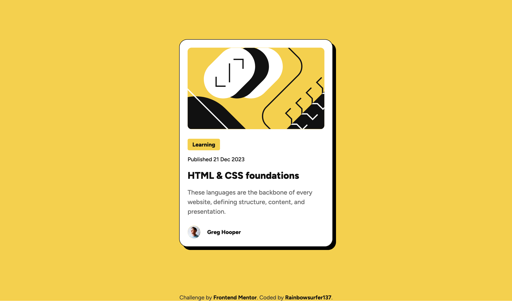

# Frontend Mentor - Blog preview card solution

This is a solution to the [Blog preview card challenge on Frontend Mentor](https://www.frontendmentor.io/challenges/blog-preview-card-ckPaj01IcS). Frontend Mentor challenges help you improve your coding skills by building realistic projects. 

## Table of contents

- [Overview](#overview)
  - [The challenge](#the-challenge)
  - [Screenshot](#screenshot)
  - [Links](#links)
- [My process](#my-process)
  - [Built with](#built-with)
  - [What I learned](#what-i-learned)
  - [Continued development](#continued-development)
- [Author](#author)

## Overview

### The challenge

Users should be able to:

- See hover and focus states for all interactive elements on the page

### Screenshot

### Links

- Solution URL: [Add solution URL here](https://your-solution-url.com)
- Live Site URL: [Add live site URL here](https://rainbowsurfer137.github.io/blog-preview-card/)

## My process

For this project, I focused on creating a responsive blog preview card using clean and efficient HTML and CSS. My approach was to first design the layout structure in HTML, followed by styling it with CSS to ensure it looked polished, worked across different screen sizes and included a hover state and focus state.

### Built with

- Semantic HTML5 markup
- CSS custom properties
- Flexbox
- Mobile-first workflow

### What I learned

This project taught me several key concepts:
- Focus States: Adding focus states to ensure accessibility and usability for keyboard users.
- CSS Box Shadows: I practiced creating neat shadow effects to add depth to the card.
- Media Queries: Writing mobile-friendly CSS and ensuring the layout adjusts well for smaller screen sizes. 
- Hover and Transition Effects: Adding a smooth color and scale transition for interactive elements to improve user experience.

### Continued development

Moving forward, I aim to:
- Explore CSS Grid for more complex layouts.
- Improve accessibility features by adding ARIA attributes where needed.
- Implement JavaScript for interactivity, such as a dark mode toggle.

## Author

- Frontend Mentor - [@rainbowsurfer137](https://www.frontendmentor.io/profile/rainbowsurfer137)
